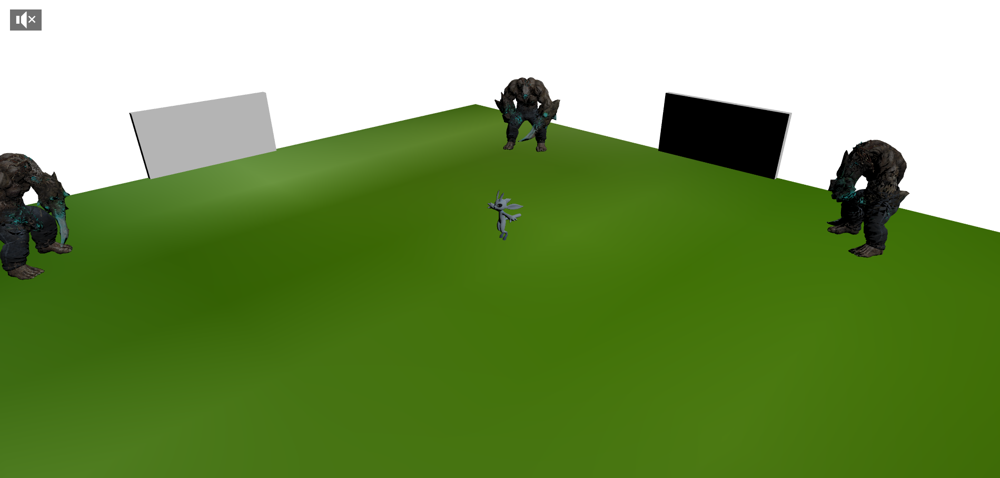
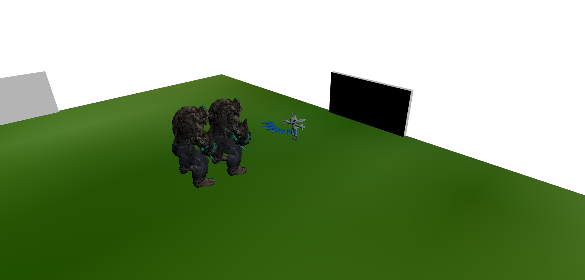
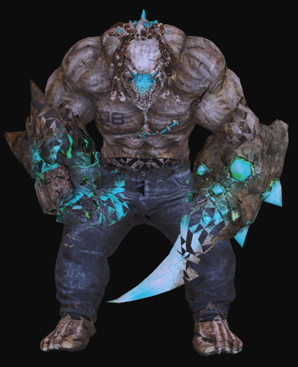
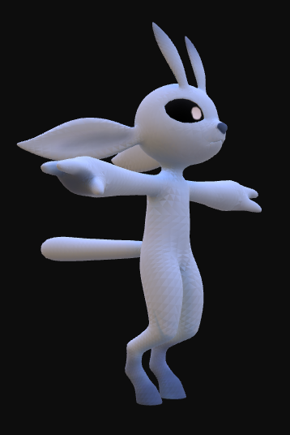
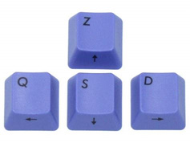

# NIRWEN : a 3D Rogue Like games
## Lucas LYON, Mohamed MAHJOUB

Thème : *Be green*

# Description :
Nirwen est un Rogue Like en vue isométrique suivante, créer avec BabylonJS à l'occasion du concours *Games On Web 2023*
Le joueur incarne "Ori", un être magique aux sorts multiple et se rendant plus impressionnant devant ses ennemis en écartant les bras. Très craintif, il est très rare de les voir repliés.
Celui-ci se défend contre ses ennemis, les terribles mutants, en envoyant des valses de pics de glace. En cas de trop forte proximité, celui-ci peut utiliser un forceshield, un puissant pouvoir repoussant ses adversaires.

# Ennemis 

Les seuls êtres encore aptes à affronter Ori sont des mutants : des créatures dont les nombreuses altérations ont réduit leur stratégie d'attaque à seulement entrer en collision avec ses opposants. Les mutants sont des êtres terriblement territoriaux : bien que tolérant la présence d'autres mutants, ceux-ci refuseront catégoriquement de se s'éloigner de la salle qu'ils se sont attribués. Certains disent qu'ils auraient simplement une phobie des portes.

# Labyrinthe
Ori évolue dans un milieu généré aléatoirement à chaque partie afin d'accroître l'expérience de jeu. Bien qu'aléatoirement réparti, chaque salle ne contient pas moins de trois mutants, mais jamais plus de 5.
Le labyrinthe lui-même est de taille variable : entre 5 et 10 salles.

# Ori 

Ori est capable d'envoyer une salve de 5 pics de glace à chaque seconde
Il est également capable d'utiliser un champ de force afin de mettre à distance ses adversaires. Cependant, celui se recharge plus lentement.
Après s'être pris un coup, Ori se voit devenir invulnérable pendant une courte période.
Ori est incapable de survivre au-delà de 10 coups reçus. Après quoi, seul une lueur verte restera de lui.

# Contrôle

Déplacer Ori : utilisez les flèches directionnelles ou les touches ZQSD pour faire avancer, reculer ou orienter Ori
Sortilèges : 
- ice_picks : presser la touche i pour envoyer un balayage de pics de glaces
- forceshield : presser la touche f pour activer le forceshield

# Note 
- Les portes sont maintenues visibles afin de faciliter le déplacement du joueur au sein du labyrinthe
- les murs faisant faces à la caméra sont intentionnellement invisibles afin que les personnages ne s'en retrouvent pas occultés 
